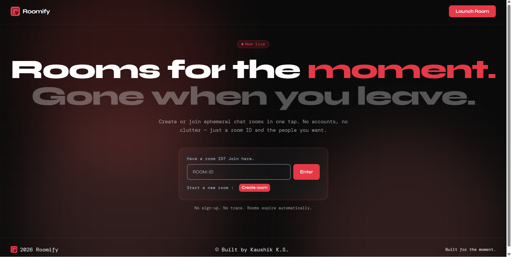
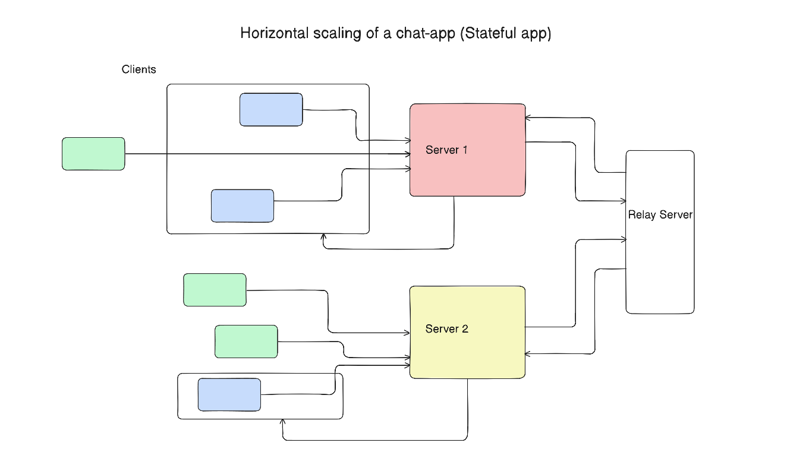

## Author - Kaushik K S  
# Roomify – Hybrid Ephemeral Chat Application

Roomify is a real-time chat application built using native WebSockets that supports room-based communication with a hybrid ephemeral messaging model. Users can create and join rooms, exchange messages, and interact in real time while messages are retained only for the lifetime of the room.

---

## Overview

Roomify allows users to:

- Create and join chat rooms using unique room IDs  
- Communicate in real time using WebSockets  
- Persist messages only as long as the room exists  
- Automatically remove all data when a room is deleted  

This hybrid approach avoids excessive in-memory storage while still providing temporary communication tied to the lifecycle of a room.

## Preview 


---

## Core Features

- Room-based chat system  
- Message persistence scoped to room lifetime  
- Automatic cleanup when a room is deleted  
- Native WebSocket implementation (no Socket.io)  
- Distributed communication using relay architecture  

---
## Messaging Model

Roomify follows a **hybrid ephemeral approach** to message storage:

- Messages are stored in a database **only for the lifetime of a room**
- No in-memory message storage is used to avoid memory overhead
- When a room is deleted, all associated messages are removed

This design keeps the system lightweight while ensuring messages are available during active sessions without long-term persistence.

---

## System Actions

The application is built around the following core actions:

- `create_room` – Create a new chat room  
- `join_room` – Join an existing room  
- `send_message` – Send a message within a room  
- `leave_room` – Leave the current room  
- `delete_room` – Delete a room and its messages  
- `register_room` – Sync room metadata across servers  
- `relay_room` – Relay messages/events between servers  

---

## Architecture

### Problem

When scaling the application to multiple server instances:

- Users connected to different servers could not communicate within the same room  
- Room state became isolated per server  
- Message delivery was inconsistent across instances  

---

### Solution: Relay-Oriented Architecture

To solve this, a **Relay Server** was introduced as a central coordination layer between all servers.


---

### How It Works

- Each server handles its own client connections and room membership  
- When a room is created, it is **registered across servers** using `register_room`  
- When a message is sent:
  - The server stores it in the database  
  - Forwards it to the Relay Server using `relay_room`  
- The Relay Server then distributes the event to all other servers ensuring equal latency across servers  
- Each server emits the message to its respective clients in that room  

---

### Outcome

- All users in a room stay synchronized regardless of which server they are connected to  
- Message flow remains consistent across distributed instances  
- Relay Server orchestrates communication to ensure uniform message propagation  

## Tech Stack

### Frontend
- React.js  
- Native WebSocket client  

### Backend
- Node.js  
- Express.js  
- Native WebSocket (`ws` library)  

### Architecture Components
- Room management system  
- Database for message storage  
- Relay server for cross-instance communication  

---
## Project Structure

```
Roomify-Hybrid-Ephemeral-chat-app/
│
├── backend/
│   ├── src/                 
│   ├── index.js             
│   ├── relay_server.js      
│   ├── notes.js                              
│   ├── package.json
│
├── frontend/
│   ├── src/
│   │   ├── components/      # Reusable UI components
│   │   ├── context/         # Global state management
│   │   ├── pages/           # Page-level components
│   │   ├── App.jsx          # Root React component
│   │   ├── main.jsx         # Entry point
│   │   └── index.css        # Global styles
│   ├── public/              
│   ├── index.html           
│   ├── vite.config.js       
│   ├── package.json
│
└── README.md
```
---

## Installation and Setup

### Prerequisites

- Node.js (v16 or higher)  
- npm or yarn  

### Clone Repository

```bash
git clone https://github.com/codewkaushik404/Roomify-Hybrid-Ephemeral-chat-app.git
cd Roomify-Hybrid-Ephemeral-chat-app
```

### Install Dependencies & Run Application

#### Backend:
```bash
cd backend
npm install
npm run dev
```

#### Frontend:
```bash
cd frontend
npm install
npm run dev
```
